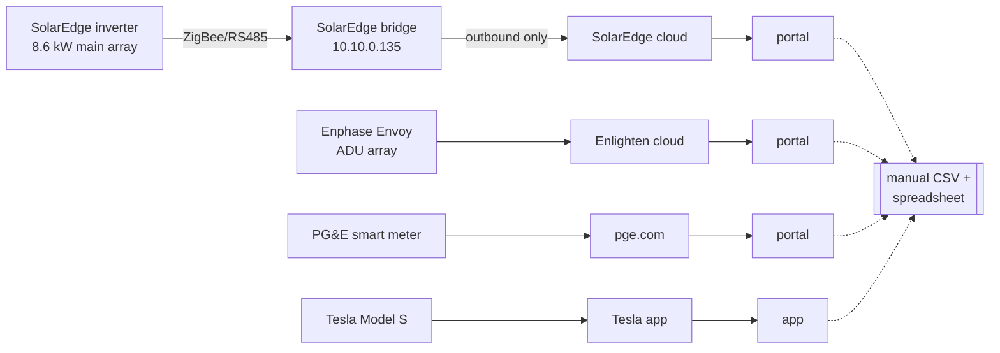
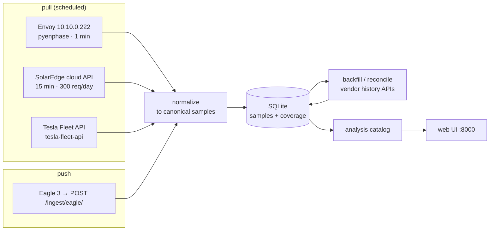
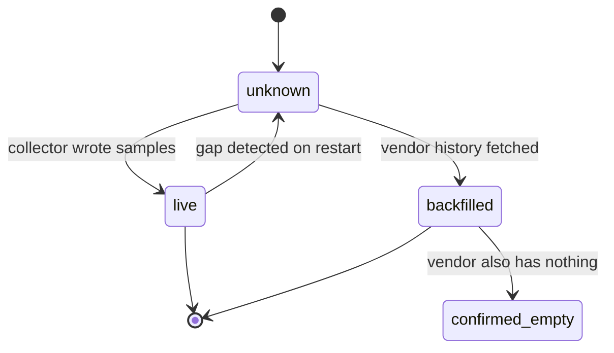

# 635 Central Home Power Monitor

## Problem

Four systems meter this property — SolarEdge, Enphase, PG&E, Tesla — and each shows only its own slice through its own vendor portal. Nothing nets them against each other, so the questions that matter are unanswerable: what actually drives the 4–9pm peak that sets the bill, how much of the solar gets used versus exported, and whether the 2015 array is still producing what it should. A year of PG&E bills answers these at monthly resolution, which is to say it doesn't answer them at all — a month is one number, and the decisions live inside the hours.

## Today

Four portals, four logins, no shared axis. Historical analysis means downloading CSVs by hand and reconciling them in a spreadsheet.

## Proposal

One Django process on `studio`, started by `launchd` at boot, listening on a port. Collectors run in-process on a scheduler; the Eagle 3 pushes to a Django view. SQLite stores everything. No Home Assistant, no InfluxDB, no Docker requirement.

### The catalog is the product

The stated requirement is *"a rich set of visuals so I don't have to think of what questions to ask."* That inverts the usual dashboard brief: the deliverable is not a blank canvas with good filters, it is an opinionated set of analyses that already encode what's known to be interesting. Filters serve the catalog, not the reverse.

Each entry below is a view, not a chart type. `†` marks ones that need the Eagle 3 and so can't ship until it's installed.

**Cost & TOU**
- Peak-window bill share — what the 4–9pm window costs per month, against the other 19 hours.
- True-up tracker — running net kWh and dollars against the April cycle, with a projection. The 2025–26 cycle closed at +1,439 kWh / $458.26; this is the number the whole project is arguing with.
- Cost heatmap — hour × day-of-year, colored by dollars, seasonal rates applied.

**Peak decomposition** `†` — the thing bills structurally cannot do
- Stacked 4–9pm attribution: EV / hot tub / baseline / unexplained.
- Load signatures — the hot tub's heater cycles, the dryer, EV charging, isolated from whole-home draw by their on/off shape.
- "Unexplained" is a first-class series, not a rounding bucket. It's how you find out the model is wrong.

**Baseline**
- Overnight floor (3–5am minimum) trended over months. A rising floor means something new is always-on, and it's the cheapest kWh anyone ever saves.

**Solar health**
- Main vs. ADU, normalized per kW installed — two arrays, two vendors, one axis. Divergence is the signal.
- Clear-sky ratio: actual against modeled expected output. Catches soiling, new shade, a dead panel.
- Degradation: annual peak-production trend. The SunPower X21s went in around 2015 and are due to show it.

**Self-consumption**
- What fraction of generation is used on-site vs. exported, by season. This is the number that decides whether a battery or load-shifting is worth anything.
- Export timing vs. peak-rate windows — exporting at 1pm and importing at 6pm is the whole problem in one chart.

**EV**
- Charge sessions: kWh, duration, cost at the TOU rate actually in effect.
- Counterfactual: what the same sessions would have cost shifted past 9pm. The Gemini analysis concluded EV load-shifting is the one lever with real headroom; this measures it instead of assuming it.

**Electrification modeling**
- Winter gas (~366 therms/yr, concentrated Nov–Feb) converted to heat-pump electric load at an adjustable COP, projected onto the existing load curve.
- Resulting array shortfall — how many more panels an all-electric house would need. Gas is the biggest energy line item on the property and the one no electric monitor can see; modeling it is the only way it enters the picture.

**Data health** — first-class, because reliability was named the top requirement
- Per-source coverage timeline: collected, backfilled, known-gap, never-attempted.
- Freshness and staleness alerts per source.

### Gaps are a normal condition

Self-hosting means the collector will be down sometimes — upgrades, mistakes, a vendor rotating an auth scheme. The design assumption is that this is routine, not exceptional.

The mechanism is an explicit **coverage table** alongside samples. Absence of a sample never means zero; it means *unknown*, and coverage records say which. Every source has a vendor cloud with history behind it, so a reconciliation pass heals holes after the fact.

Charts render gaps as gaps. Nothing interpolates across a hole, and no aggregate silently treats missing minutes as zero — a month with a three-day outage must not quietly report itself as a low-usage month.

### Mixed resolution is permanent

Sources disagree on resolution and always will: Eagle 3 at sub-minute, Envoy at ~1 minute, SolarEdge cloud at 15. Samples are stored at native resolution with the resolution recorded, and the UI shows coarse sources as visibly coarse — stepped, not smoothed. Upsampling SolarEdge to 1-minute would manufacture detail that does not exist, in the one place where fake precision would be most misleading.

## Scope

| In | Out |
| --- | --- |
| Django + SQLite, single process, `launchd` at boot | Home Assistant, InfluxDB, TeslaMate, Grafana |
| Envoy via `pyenphase` (incl. JWT refresh) | Docker as a requirement |
| SolarEdge via cloud Monitoring API, 15-min | Local Modbus RS485 wiring — designed for, not built |
| Eagle 3 push endpoint (when hardware arrives) | Control — this reads, it never actuates |
| Tesla Fleet API, key hosted at `sef.kloninger.com` | Remote access / auth beyond the LAN |
| Backfill + coverage tracking as core mechanism | Real-time alerting beyond source staleness |
| Analysis catalog above | Gas *metering* — modeled from bills only |
| Historical seeding from the 2025–26 bill data | Multi-property, multi-user |

### Build order

The Eagle 3 hasn't arrived, so grid data — the highest-value source — is last. That sets the sequence: `Envoy` (reachable today, proves the ingest and coverage model end to end) → `SolarEdge cloud` (proves mixed resolution) → `bill seeding` (makes cost analyses real before any live grid data exists) → `Tesla` → `Eagle 3` on arrival → peak decomposition, which needs it.

## Assumptions

| Assumption | If wrong |
| --- | --- |
| Envoy local API stays reachable with `pyenphase` token refresh | Fall back to Enlighten cloud API; ADU drops to coarser resolution |
| SolarEdge cloud API is enough at 15-min for v1 | Wire RS485 to the inverter (~$15–40); source layer is built for this swap |
| Eagle 3 exposes a local push/poll API without cloud dependency | Grid data falls back to PG&E Green Button downloads — daily at best, and peak decomposition `†` becomes impossible |
| SolarEdge bridge uses ZigBee, leaving RS485 free | The RS485 bus already has a master; local Modbus needs the inverter moved to ethernet instead |
| Tesla Fleet API free tier covers one car | Poll less often, or drop to charge-session polling only |
| 1-minute resolution suffices for load signatures | Hot tub and dryer stay indistinguishable; decomposition needs sub-minute from the Eagle |
| SQLite handles ~2.1M rows/yr with rollups | Postgres 17 is already running on this host |
| Bill-derived rates (~$0.66/$0.45 summer, ~$0.625/$0.571 winter) are close enough | Cost analyses drift from the actual bill; needs a real rate table with NEM credit rules |
| ADU array is ~1.75–2 kW (5 panels, IQ7+) | Per-kW normalization is off; read the real figure off the Envoy |

## Open questions

1. Does the Eagle 3, once installed, support local push without a Rainforest cloud account? — answerable only when the hardware arrives.
2. Is the SolarEdge RS485 bus free, or is the bridge using it? — needs a look at the inverter's terminal block.
3. Should NEM export credits be modeled at true retail rate, or does the PCE/WestLight generation split change the math? — worth one careful read of an actual bill before the cost analyses are trusted.

## Success

The honest test is whether it survives being ignored. Three months in: no manual intervention, no gaps that weren't automatically healed, and the coverage view is green without anyone having tended it.

The analysis test is that it produces at least one thing the bills couldn't — a named load driving the winter peak, or a measured self-consumption ratio — that changes what actually gets done in this house.

And since building it is the point: the test that matters most is whether adding the tenth analysis to the catalog is still enjoyable, or whether it has become a chore.
